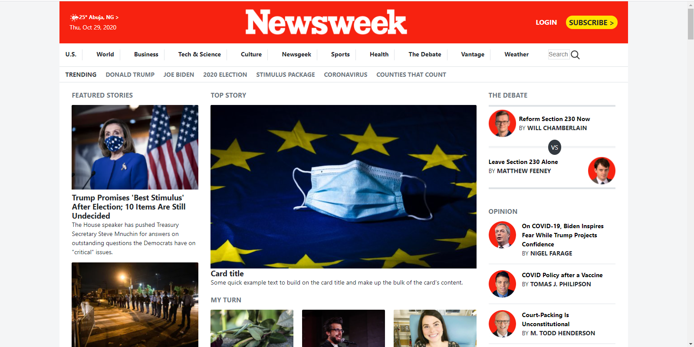
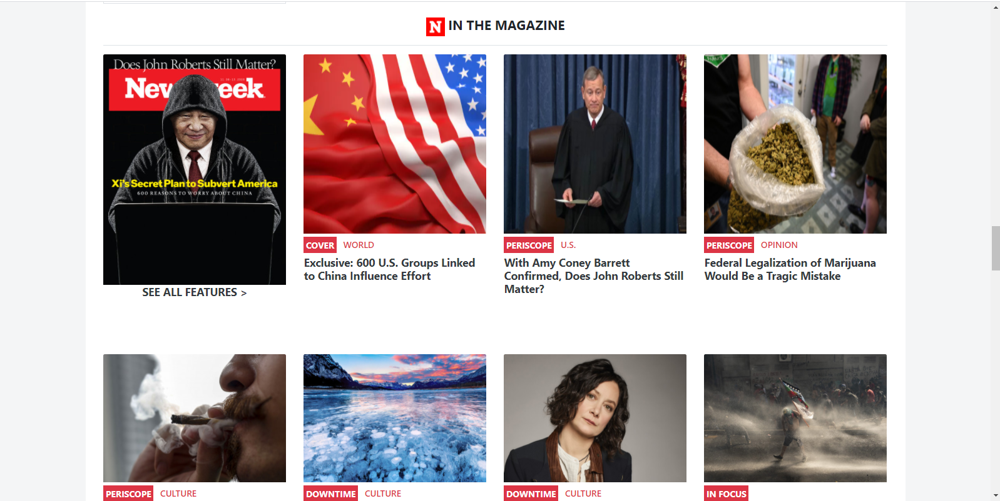
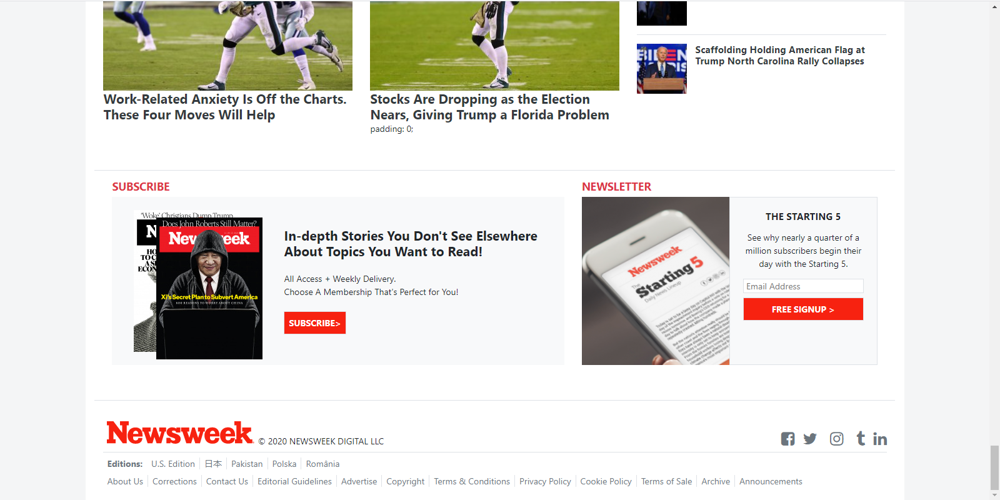

# Newsweek Clone Webpage.

> This project consists of building a clone of the [Newsweek](https://www.newsweek.com/) website.

<!-- 

---

---
 -->

## Features on the project:

- Mainly use of bootstrap framework for the page building;
- A responsive design with 2 breakpoints (768px and 992px);
- Mobile and Desktop version;
- Elements aligned using flex or grid, also with boostrap.

## Built With

- Bootstrap
- HTML
- CSS
- VS Code, Git & GitHub

<!-- ## Live Demo

[Live Demo Link](https://anapdh.github.io/TheNextWeb-Clone/) -->

## Authors

👩‍💻 **Ana Paula Hübner**

- GitHub: [@anapdh](https://github.com/anapdh)
- LinkedIn: [Ana Paula Hübner](https://www.linkedin.com/in/ana-paula-h%C3%BCbner-7a9484181/)

👨‍💻 **Godwin Nwachukwu**

- GitHub: [@Gnwin](https://github.com/Gnwin)
- Twitter [@gmarxr](https://twitter.com/gmarxr)
- LinkedIn: [Godwin Nwachukwu](https://www.linkedin.com/in/n-gwin/)

## Show your support

Give a ⭐️ if you like this project!

## 📝 License

This project is [MIT](lic.url) licensed.